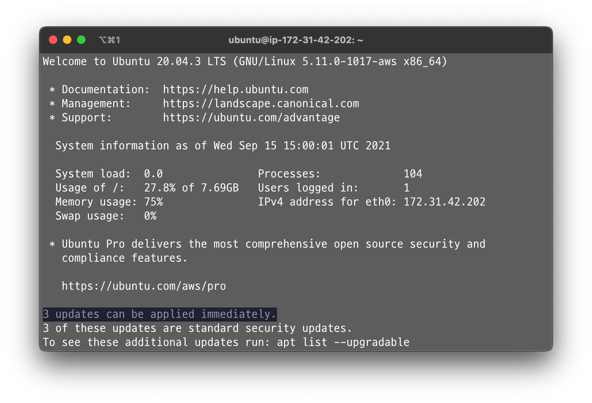
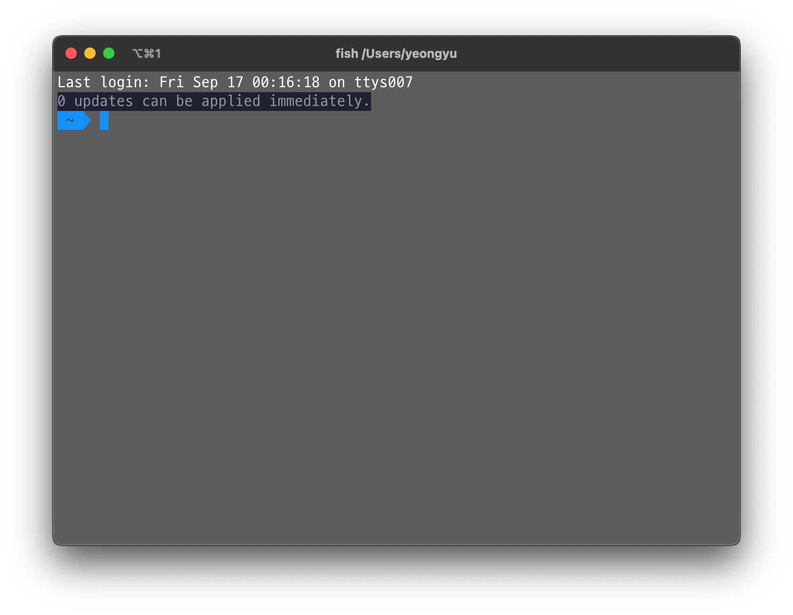

<p align="center">
  
</p>
<p align="center">
    <em>Get the number of Brew Packages to update, just like you've experienced from Ubuntu</em>
</p>

---

BrewUpdate is a simple utility written in Go, notify you how many packages to update every time when you execute the terminal.

_This project is currently in progress, so the following features cannot work as expected._

The key features are:

- Fast: Caching the packages to update
  - The execution time of `brew update; brew outdated`: `7.42 seconds`
  - The execution best time of `brew-updates` (cached): `271.91 millis` - **approximately 27x faster**
- Easy: Simply downloadable using brew
- Easy to setup: Just by specifying what shell you use, the setup can be done
- Friendly: The apt-like notifications from brew

---

## Example

When you open terminal in ubuntu, you can see the following:


When you have installed BrewUpdates, you can see the following:


You can do the similar thing with the `brew update; brew upgrade` command, which takes a few seconds.

With the BrewUpdates, your update history will be recorded locally so you don't have to wait for a few seconds to get result.

---

## Installation

```
/bin/bash -c "$(curl -fsSL https://raw.githubusercontent.com/code-yeongyu/brew-updates/master/install/install.sh)"
```

I have plan to upload this project to the brew, so that you can download easily.

However, still I got some works to do, so currently it's not supported to install automatically using brew.

---

## Build

Follow the below instructions sequentially. Let's start with the installing `brew` and `go`. You can skip installing it if you already have it.

### Install brew

```sh
/bin/bash -c "$(curl -fsSL https://raw.githubusercontent.com/Homebrew/install/HEAD/install.sh)"
```

### Install go

```sh
brew install go
```

### Clone this repository

```sh
git clone git@github.com:code-yeongyu/brew-updates.git
```

### Install dependencies

```sh
cd src/
go mod tidy
```

### Compile & Install

```sh
CGO_ENABLED=0 go build -a -o bin/brew-updates main.go; \
mv bin/brew-updates /usr/local/bin
```

### Run!

```sh
./brew-updates
```

---
